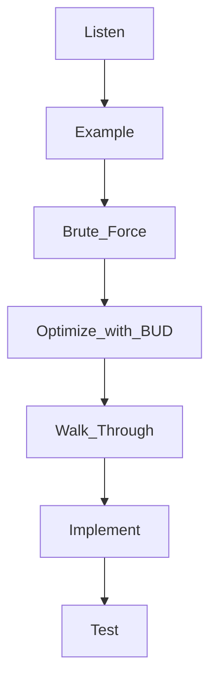

# Technical Questions

## How to Prepare

1. Try to solve the problem on your own.
2. Write the code on paper.
3. Test the code on paper.
4. Type your code as-is into the computer

MOCK INTERVIEW AS MUCH AS POSSIBLE
www.pramp.com

## Must Have Knowledge

| Data Structures      | Algorithms           | Concepts                 |
| -------------------- | -------------------- | ------------------------ |
| Linked Lists         | Breadth-First Search | Bit Manipulation         |
| Trees, Tries, Graphs | Depth-First Seach    | Memory - Stacks vs Heaps |
| Stacks,Queues        | Binary Search        | Recursion                |
| Heaps                | Merge Sort           | Dynamic Programming      |
| Vectors/Arrays       | Quick Sort           | Big O - Time & Space     |
| Hash Tables          |                      |                          |

## Problem Solving Flow Chart

### BUD

Bottlenecks
Unnecessary Work
Duplicated Work
